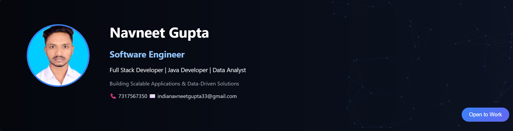

# 🎯 LinkedIn Banner Generator

A modern and customizable **LinkedIn Banner Generator** built using **HTML, CSS, and JavaScript**.  
This project helps developers and professionals create **clean, professional, and animated LinkedIn banners** for personal branding.

---

## 🚀 Live Demo

🔗 (Add your Netlify/Vercel link here)

---

## 📌 Features

- 🎨 Modern & minimal UI (FAANG-style design)
- 📱 Fully responsive layout
- ⚡ Smooth animations and interactive elements
- 🧩 Customizable text (name, role, skills, contact)
- 🖼️ Dynamic background with animated effects
- 🔧 Easy to edit and personalize

---

## 🛠️ Tech Stack

- **HTML5** – Structure  
- **CSS3** – Styling & layout  
- **JavaScript (Vanilla)** – Interactivity & animations  

---

## 📂 Project Structure


LinkdIn-Banner/
├── index.html
├── style.css
├── script.js
├── banner.png
└── profile.jpg


---

## 🎯 Use Case

- Create **professional LinkedIn banners**
- Personal branding for developers
- Portfolio enhancement
- Resume/profile improvement

---

## 📸 Preview



---

## ⚙️ How to Use

1. Clone the repository:
```bash
git clone https://github.com/Navneetgupta440/LinkdIn-Banner.git

2. Open index.html in your browser
3. Customize:
* Name
* Role
* Skills
* Contact details
* Background style
